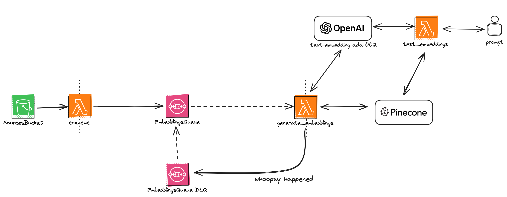

<!--
title: 'AWS Python Example'
description: 'This template demonstrates how to deploy a Python function running on AWS Lambda using the traditional Serverless Framework.'
layout: Doc
framework: v3
platform: AWS
language: python
priority: 2
authorLink: 'https://github.com/serverless'
authorName: 'Serverless, inc.'
authorAvatar: 'https://avatars1.githubusercontent.com/u/13742415?s=200&v=4'
-->


# Serverless Embeddings Generate & Store - Serverless Framework AWS

This was generated using the Serverless Framework AWS Python template. 

This is an example of a way to generate and store embeddings for new documents in an S3 bucket usings Lambda, SQS, Pinecone(Serverless) and OpenAI(text-embedding-ada-002).

## Plugins
- serverless-python-requirements
- serverless-lift

## Architecture



## Usage

Install the Serverless Framework:

```bash
npm install -g serverless
```

Install the dependencies:

```bash
npm install
```

Add your environment variables to a `.env` file in the root of the project. 

```bash
cp .env.local .env.dev
cp .env.local .env
```

### Deployment

In order to deploy the example, you need to run the following command:

```
$ serverless deploy
```

After running deploy, you should see output similar to:

```bash
Deploying serverless-embeddings-generator to stage dev (us-east-1)

✔ Service deployed to stack serverless-embeddings-generator-dev (70s)

functions:
  enqueue: serverless-embeddings-generator-dev-enqueue (25 MB)
  testEmbeddings: serverless-embeddings-generator-dev-testEmbeddings (25 MB)
  EmbeddingsQueueWorker: serverless-embeddings-generator-dev-EmbeddingsQueueWorker (25 MB)
SourcesBucket: serverless-embeddings-generator-sourcesbucket
EmbeddingsQueue: https://sqs.us-east-1.amazonaws.com/....
```

### Invocation

After successful deployment, you can invoke the deployed function by using the following command:

```bash
sls invoke -f testEmbeddings --data "hello world"  
```

Which should result in response similar to the following:

```json
{
    "matches": [
        {
            "id": "7e0807da-ef2c-4ffb-8a0f-45ae9f4aa20e#chunk1",
            "score": 0.801362216,
            "values": [],
            "metadata": {
                "chunk_index": 0,
                "source_url": "source.com",
                "text": "hello there friend"
            }
        },
    ],
    "namespace": "",
    "usage": {
        "read_units": 6
    }
}
```

### Bundling dependencies

In case you would like to include third-party dependencies, you will need to use a plugin called `serverless-python-requirements`. You can set it up by running the following command:

```bash
serverless plugin install -n serverless-python-requirements
```

Running the above will automatically add `serverless-python-requirements` to `plugins` section in your `serverless.yml` file and add it as a `devDependency` to `package.json` file. The `package.json` file will be automatically created if it doesn't exist beforehand. Now you will be able to add your dependencies to `requirements.txt` file (`Pipfile` and `pyproject.toml` is also supported but requires additional configuration) and they will be automatically injected to Lambda package during build process. For more details about the plugin's configuration, please refer to [official documentation](https://github.com/UnitedIncome/serverless-python-requirements).
